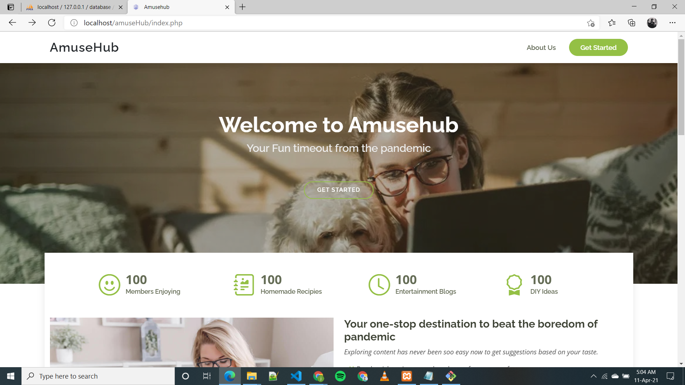
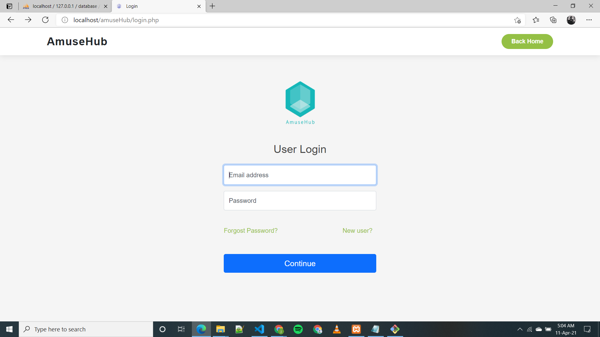
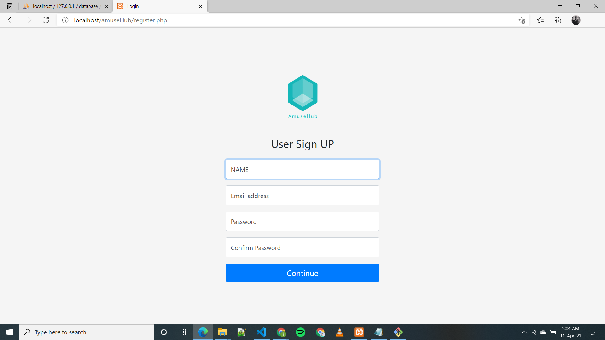
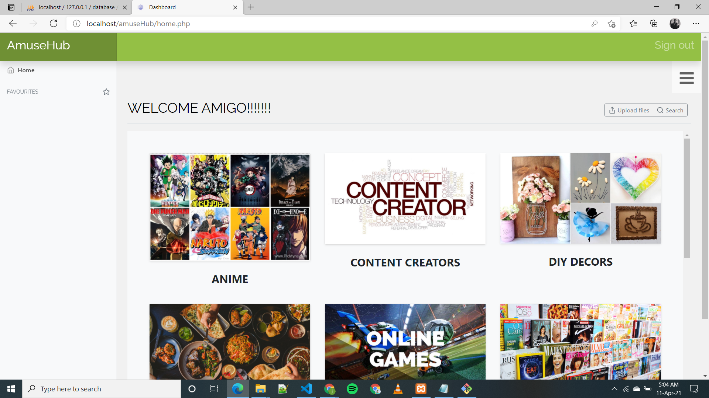
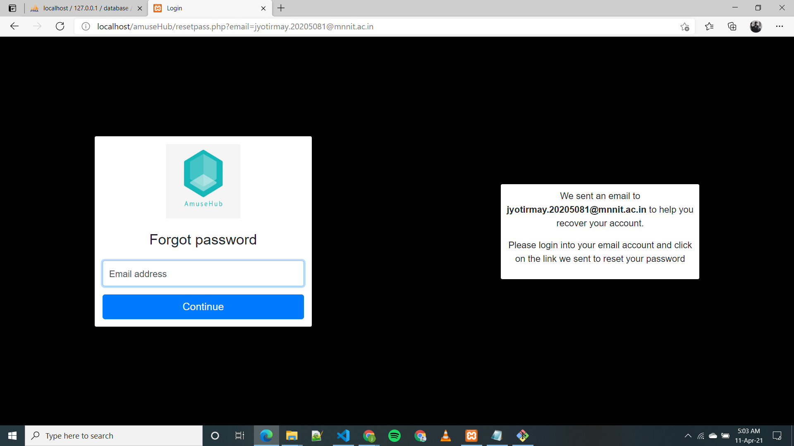
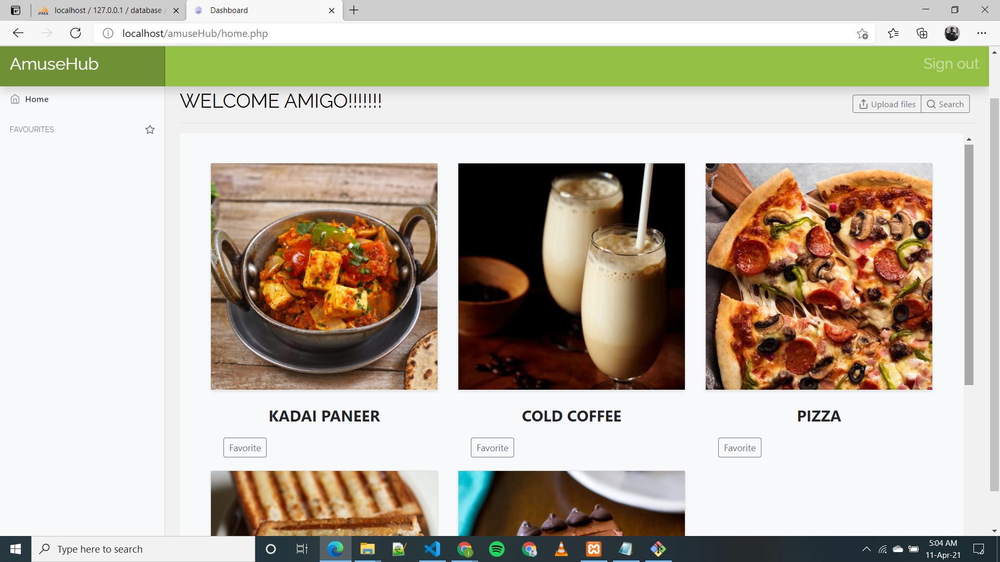
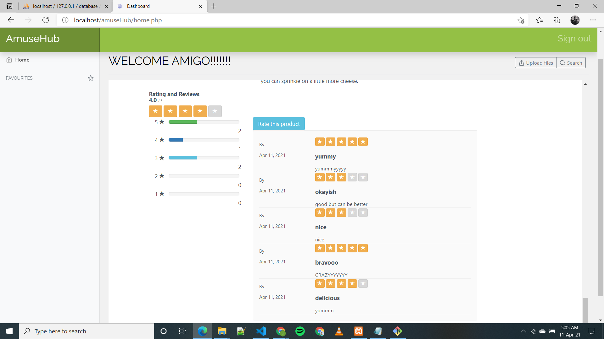
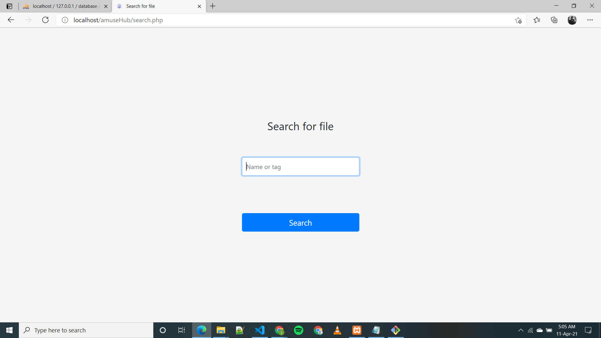

<h1 align="center">AmuseHub</h1>

## Introduction:
  We have created a solution in the form of
Amusehub to the problem stated. We provide
almost all content one may try to look for when
wanting to do something creative or to kill some
boredom. With the best recommendations and
reviews, it is now a piece of cake to select the
best pick for yourself. We also provide a
cu stomized search option to find the best you
can do with available things. You can integrate
different activities like a movie while cooking and
thousands of different combinations possible
  
## Demo Video Link:

[![Watch the video]](https://youtu.be/WcTrIZ6_6bw)
  
  
## Presentation Link:
  <a href="https://drive.google.com/file/d/1XkIJOPo7lT2wb-O2HZunc0dx68W_Locr/view?usp=sharing"> ppt link here </a>
  
  
## Table of Contents:

## Technology Stack:
  1) Node.JS
  2) Google Collab
  3) Javafx
  4) Machine Learning
  

  ## Contributors:

Team Name: CodeKar

* [Jyotirmay Jain](https://github.com/jyotirmay27)
* [Parth Mittal](https://github.com/Parthtrap)
* [Ujjwal Tyagi](https://github.com/ujjwaltyagi888)
* [Abhinav Goel](https://github.com/abhinav2401)

### Made at:

## Screenshots

  
  

  

  

  
  

  

  

  

  

  

  

 
